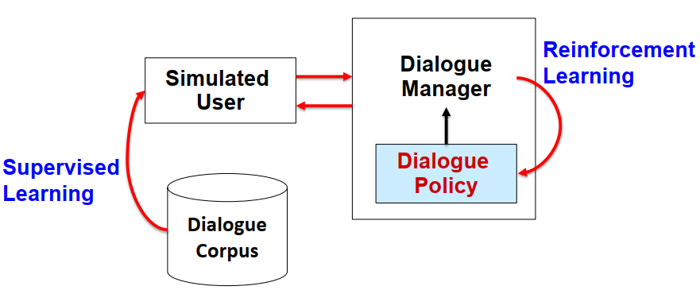
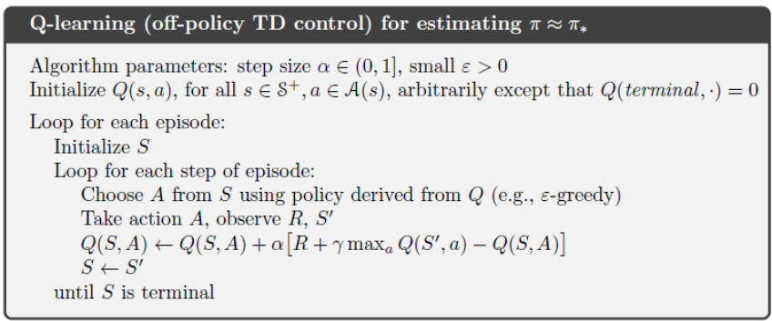

## A Simple Dialogue System whose Behavior is Driven by a Reinforcement Learned Policy  

### Description

In this project, a simple dialogue system that provides restaurant recommendations is build. In the heart of the dialogue system, there is a Dialogue Manager (DM) that has a policy based on which it decides what the system should do next. The DM is frame-based and it is trained using Reinforcement Learning. 

### Dialogue Manager

The DM queries for 3 slots: food type, price and the location, and returns the matching restaurants in the database. 

The DM has explicit confirmation policy that confirms every information provided by the user. For example, if the user requests "Italian" food then the system explicit confirmation
request would be "did you say Italian?".  

The DM chooses among 6 possible system actions:
>REQUEST_FOOD_TYPE, REQUEST_PRICE, REQUEST_LOCATION, EXPLICIT_CONFIRM_FOOD_TYPE,
EXPLICIT_CONFIRM_PRICE, EXPLICIT_CONFIRM_LOCATION.  

The DM also handles cases where the user provides irrelevant information or doesn't say anything. However, it does not handle cases where the user provides more information than what is requested.

### Simulated User

To train the policy a simulated user is needed. The simulated user is defined in `SimulatedUser.py`. 

The simulated user responds to system information requests:

* provide relevant information with probability p = 0.8
* provide irrelevant information with probability 1- p = 0.2

The simulated user responds to system confirmation requests:

* positively confirm (YES) with probability p1 = 0.8
* negatively confirm (YES) with probability p2 = 0.1
* provide irrelevant information with probability of 1- p1 - p2 = 0.1

The above probability values are tuned to enhance the overall performance of the system

The simulated user has 9 possible actions:

>PROVIDE_FOOD_TYPE, PROVIDE_PRICE, PROVIDE_LOCATION, CONFIRM_POS_FOOD_TYPE, CONFIRM_NEG_FOOD_TYPE, CONFIRM_POS_PRICE, CONFIRM_NEG_PRICE, CONFIRM_POS_LOCATION,
>CONFIRM_NEG_LOCATION  .  

### Reinforcement Learning

The reinforcement learning policy learns to request information about each slot and then confirms the slot (querying the database is not part of the reinforcement learning problem). So, for the reinforcement learning problem the state space can be simplified. Only the following state variables are needed (instead of the actual value for each slot):  

> <FOOD_TYPE_FILLED>: no | yes
> <PRICE_FILLED>: no | yes
> <LOCATION_FILLED>: no | yes 
> <FOOD_TYPE_CONF>: no | yes
> <PRICE_CONF>: no | yes
> <LOCATION_CONF>: no | yes 

Q-learning algorithm with ε-greedy exploration is used for learning. Some of the important parameters (after tuning) are shown below,  

* A decaying exploration rate is used. Initial exploration rate is set to 1.0 and the decay rate is set to 0.001 per 10 episodes.
* The value of γ is set to 0.99. 
* The learning rate α is equal to 1/(1+current_episode_number).

* The reward function is set as: 500 points when all slots are both filled and confirmed and -5 points for every system action.

* Each episode times out after a set number of actions (`max_num_actions=30`). 
* The number of episodes is set to 5000 to ensure convergence (the total reward for each episode stops fluctuating too much and stabilizes. 

After training is done, The learned dialogue policy is saved in `policy.txt` where each line corresponds to a state and the best action for that state.

### Testing

During testing (`system_test.py`), the program reads in the policy and uses the policy to drive the system behavior. 

Simple natural language understanding and generation are applied to interact with the user. The program parses the user input, queries the database, and presents user the results. The natural language understanding is performed using simple keyword matching. And the natural language generation is template-based.

An example of the interaction between the user and the dialogue system:

> System: How expensive a restaurant do you want?
>
> User: Good question.
>
> System: How expensive a restaurant do you want? (note here that the system asks the same question, which is to be expected because after the irrelevant user response the state hasn’t changed, so the policy is going to select the same action, there is no training here, this is during testing and the policy is fixed)
>
> User: Something expensive in Hollywood. (note that here Hollywood will be ignored because the system asked for the price only)
>
> System: What type of food do you want?
>
> User: Maybe something.
>
> System: What type of food do you want? (note here that the system asks the same question, which is to be expected because after the irrelevant user response the state hasn’t changed, so the policy is going to select the same action, there is no training here, this is during testing and the policy is fixed)
>
> User: any
>
> System: Ok you said you wanted any type of food restaurant, right?
>
> User: Yes.
>
> System: Ok you said you wanted an expensive restaurant, right?
>
> User: what?
>
> System: Ok you said you wanted an expensive restaurant, right? (note here that the system asks the same question, which is to be expected because after the irrelevant user response the state hasn’t changed, so the policy is going to select the same action, there is no training here, this is during testing and the policy is fixed)
>
> User: yes
>
> System: Where would you like the restaurant to be located?
>
> User: in hollywood
>
> System: Ok you said you wanted a restaurant in Hollywood, right?
>
> User: Yes.
>
> System: I found 3 restaurants matching your query. Hiroshima is an expensive Japanese restaurant in Hollywood. The phone number is 310-356-7264. Mr. Changs is an expensive Chinese restaurant in Hollywood. The phone number is 310-535-7545. Canyon Road is an expensive Mexican restaurant in Hollywood. The phone number is 310-235-4636.  
